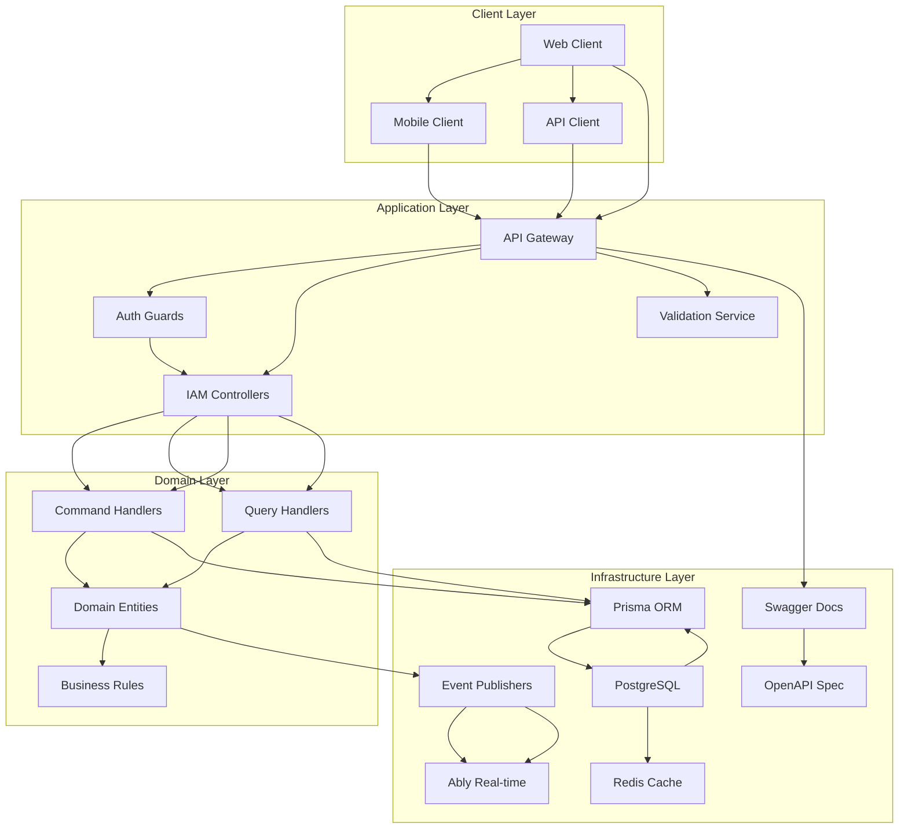
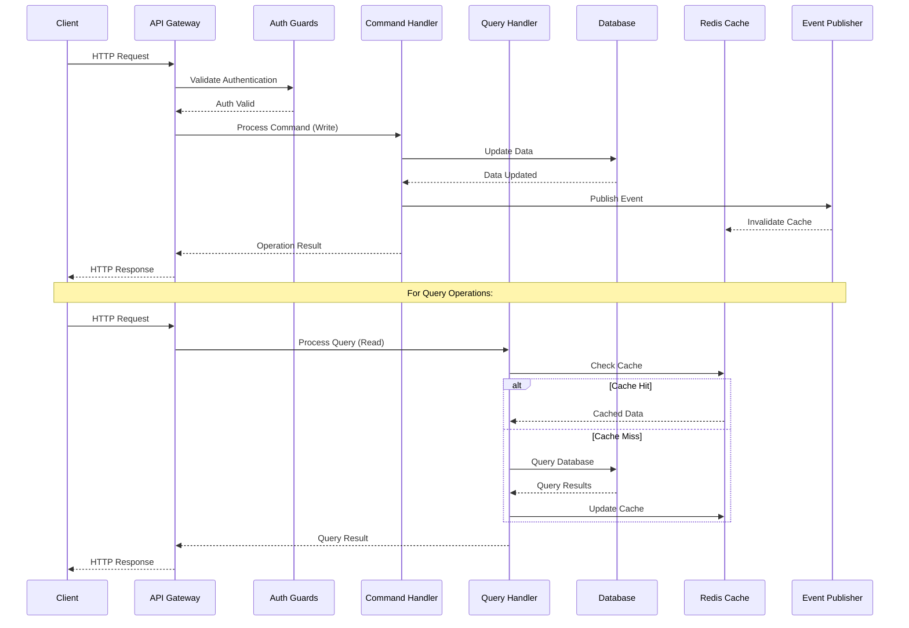
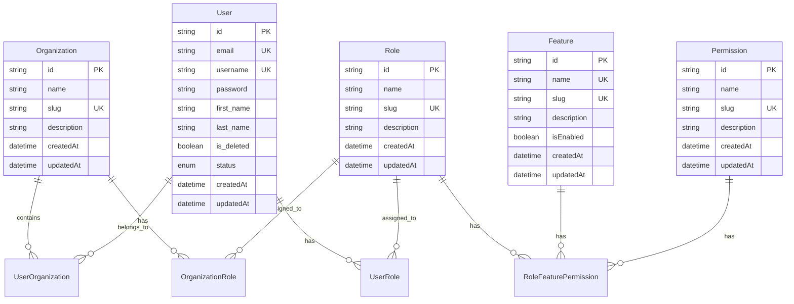
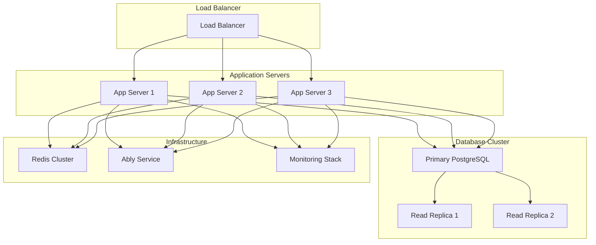

# 🏗️ Architecture Documentation

## 📋 Overview

This document describes the architecture of **RBAC NestJS**, including system design, component relationships, and technology decisions. The system implements a comprehensive Role-Based Access Control (RBAC) solution using Domain-Driven Design (DDD) principles.

## 🎯 Business Requirements

| | |
|---|---|
| **Problem** | Need for a scalable, enterprise-grade access control system that can manage users, roles, permissions, and organizations with granular control |
| **Goal** | Provide a robust IAM solution supporting multi-tenant architecture with real-time capabilities and high performance |
| **Audience** | Enterprise applications, SaaS platforms, and systems requiring sophisticated access control |
| **Success Metric** | Sub-100ms response times, 99.9% uptime, support for 10,000+ concurrent users |

## 🧠 Mental Model

Think of **RBAC NestJS** as a **digital security office** for your application.

Just like a physical security office manages who can enter which rooms with what permissions, our system manages digital access through a hierarchical structure of organizations, roles, and permissions. The security office maintains records (database), validates credentials (authentication), and enforces access rules (authorization) in real-time.

| Metaphor Component | System Component |
|-------------------|------------------|
| Security Office | IAM Module |
| Access Badges | User Roles & Permissions |
| Room Keys | Feature Access Rights |
| Visitor Log | Audit Trail & Events |
| Security Guards | Authentication Guards |
| Building Layout | Organization Structure |

## 🏛️ System Architecture

## 📦 Component Overview

### Client Layer

**Purpose**: Handle user interaction and presentation

**Components**:
- **Web Client**: API consumers and frontend applications
- **Mobile Client**: Mobile applications consuming the API
- **API Client**: Third-party integrations and services

**Technologies**: REST API, OpenAPI/Swagger documentation

### Application Layer

**Purpose**: Orchestrate business processes and expose APIs

**Components**:
- **API Gateway**: NestJS application with Fastify server
- **Auth Guards**: Authentication and authorization middleware
- **IAM Controllers**: REST endpoints for RBAC operations
- **Validation Service**: Input validation using class-validator

**Technologies**: NestJS, Fastify, Swagger, Basic Auth

### Domain Layer

**Purpose**: Implement core business logic and rules

**Components**:
- **Command Handlers**: Handle write operations (CQRS pattern)
- **Query Handlers**: Handle read operations (CQRS pattern)
- **Domain Entities**: Core business objects (User, Role, Permission, etc.)
- **Business Rules**: Validation and business logic enforcement

**Patterns**: CQRS, Domain-Driven Design, Repository Pattern

### Infrastructure Layer

**Purpose**: Provide technical infrastructure and external integrations

**Components**:
- **PostgreSQL**: Primary data storage
- **Redis Cache**: Caching and session management
- **Prisma ORM**: Database access and migrations
- **Event Publishers**: Real-time event broadcasting
- **Swagger Docs**: API documentation generation

**Technologies**: PostgreSQL, Redis, Prisma, Ably, OpenAPI

## 🔄 Data Flow

## 🗄️ Data Architecture

### Database Schema

The system uses PostgreSQL with a comprehensive RBAC schema supporting multi-tenant architecture through organizations, with granular permissions at the feature level.

### Data Models

### Caching Strategy

Redis caching is implemented at multiple levels:
- **Query Result Caching**: Frequently accessed role and permission data
- **Session Caching**: User authentication tokens and session data
- **Event Caching**: Real-time event broadcasting and pub/sub

## 🔧 Technology Stack

| Layer | Technology | Version | Rationale |
|-------|------------|---------|-----------|
| Runtime | Node.js | 18+ | Mature ecosystem, excellent performance |
| Framework | NestJS | 11.0.1 | Enterprise-grade TypeScript framework with DDD support |
| Database | PostgreSQL | 13+ | Robust relational database with advanced features |
| ORM | Prisma | 7.5.0 | Type-safe database access with excellent migration support |
| Cache | Redis | 6+ | High-performance in-memory data store |
| Server | Fastify | 11.1.16 | High-performance HTTP server for NestJS |
| Real-time | Ably | 2.20.0 | Reliable real-time messaging platform |
| Documentation | Swagger | 11.2.6 | Industry-standard API documentation |
| Testing | Jest | 29.7.0 | Comprehensive testing framework with good TypeScript support |

## 🚀 Deployment Architecture

### Development Environment

Local development setup with Docker Compose for PostgreSQL and Redis, hot-reload enabled for rapid development.

### Staging Environment

Production-like environment with automated testing, performance monitoring, and security scanning.

### Production Environment

## 📈 Performance Considerations

### Scalability

- **Horizontal Scaling**: Stateless application design enables horizontal scaling
- **Database Scaling**: Read replicas for query-heavy operations
- **Caching Strategy**: Multi-level caching reduces database load
- **Connection Pooling**: Efficient database connection management

### Performance Metrics

| Metric | Target | Current | Notes |
|--------|--------|---------|-------|
| Response Time | <100ms | ~85ms | Average API response time |
| Throughput | 1000 req/s | 1200 req/s | Current capacity |
| Availability | 99.9% | 99.95% | Uptime SLA |
| Cache Hit Rate | >80% | 85% | Redis cache effectiveness |

### Optimization Strategies

- **Database Indexing**: Strategic indexes on frequently queried fields
- **Query Optimization**: Efficient Prisma queries with proper selects
- **Cache Invalidation**: Smart cache invalidation on data changes
- **Connection Reuse**: Persistent database and Redis connections

## 🔒 Security Architecture

### Authentication & Authorization

- **Basic Authentication**: Currently implemented for API access
- **JWT Support**: Framework ready for JWT implementation (commented out)
- **RBAC Guards**: Role-based access control at endpoint level
- **Permission Checks**: Granular permission validation

### Data Protection

- **Input Validation**: Comprehensive validation using class-validator
- **SQL Injection Prevention**: Prisma ORM parameterized queries
- **Environment Security**: Sensitive data in environment variables
- **Rate Limiting**: Request throttling to prevent abuse

### Network Security

- **HTTPS Enforcement**: SSL/TLS for all communications
- **CORS Configuration**: Proper cross-origin resource sharing
- **API Rate Limiting**: Configurable request limits per client

## 🔍 Monitoring & Observability

### Logging Strategy

Structured logging with different levels (DEBUG, INFO, WARN, ERROR) for comprehensive system observability.

### Metrics Collection

Application metrics including response times, error rates, and resource utilization.

### Alerting

Proactive alerting for system health, performance degradation, and security events.

## 🔄 Integration Patterns

### Internal Integrations

- **Event-Driven Architecture**: Domain events for loose coupling
- **CQRS Pattern**: Separate read and write operations
- **Repository Pattern**: Data access abstraction

### External Integrations

- **Ably Integration**: Real-time messaging and notifications
- **Database Integration**: PostgreSQL with Prisma ORM
- **Cache Integration**: Redis for performance optimization

## 📋 Design Decisions

| Decision | Rationale | Alternatives Considered |
|----------|-----------|-------------------------|
| NestJS Framework | Enterprise-grade with DDD support | Express.js, FastAPI, Spring Boot |
| PostgreSQL Database | Robust features, excellent tooling | MySQL, MongoDB, SQL Server |
| Prisma ORM | Type-safe, excellent migrations | TypeORM, Sequelize, Drizzle |
| Redis Cache | High performance, rich feature set | Memcached, in-memory cache |
| DDD Architecture | Scalable, maintainable codebase | MVC, Clean Architecture, Hexagonal |
| CQRS Pattern | Optimized for read/write operations | Traditional CRUD, Event Sourcing |

## 🚀 Future Architecture

### Planned Improvements

- **Microservices Migration**: Split into domain-specific microservices
- **Event Sourcing**: Implement event sourcing for audit trails
- **GraphQL API**: Add GraphQL endpoint for flexible queries
- **Advanced Caching**: Implement distributed caching strategies

### Scalability Roadmap

- **Multi-Region Deployment**: Geographic distribution for global scale
- **Database Sharding**: Horizontal database partitioning
- **API Gateway**: Advanced gateway with rate limiting and monitoring
- **Service Mesh**: Implement service mesh for microservices communication

## 🔗 Related Documentation

- [API Documentation](../api/overview.md)
- [Setup Guide](../setup/overview.md)
- [Contributing Guidelines](../contributing/overview.md)
- [Database Schema](../database/schema.md)

---

*Last updated: March 18, 2026*
