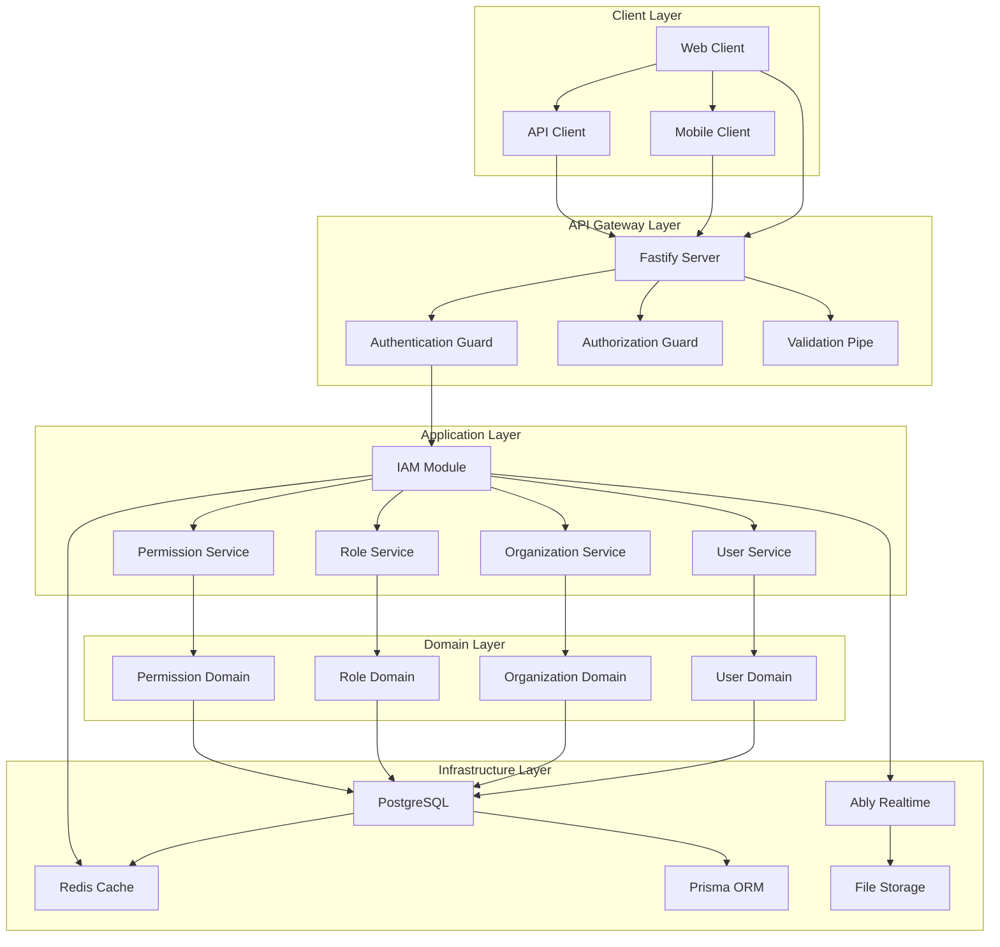
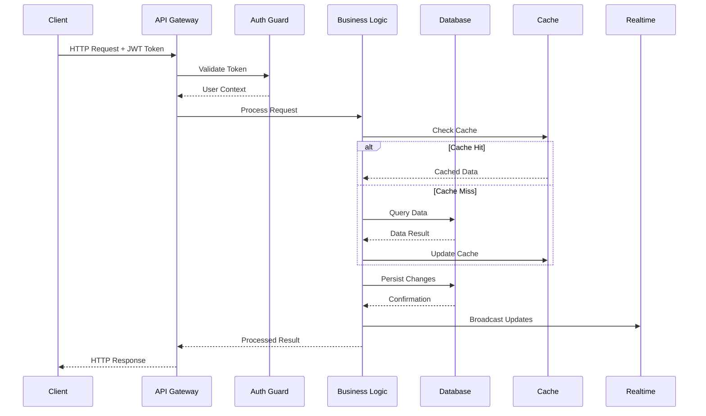
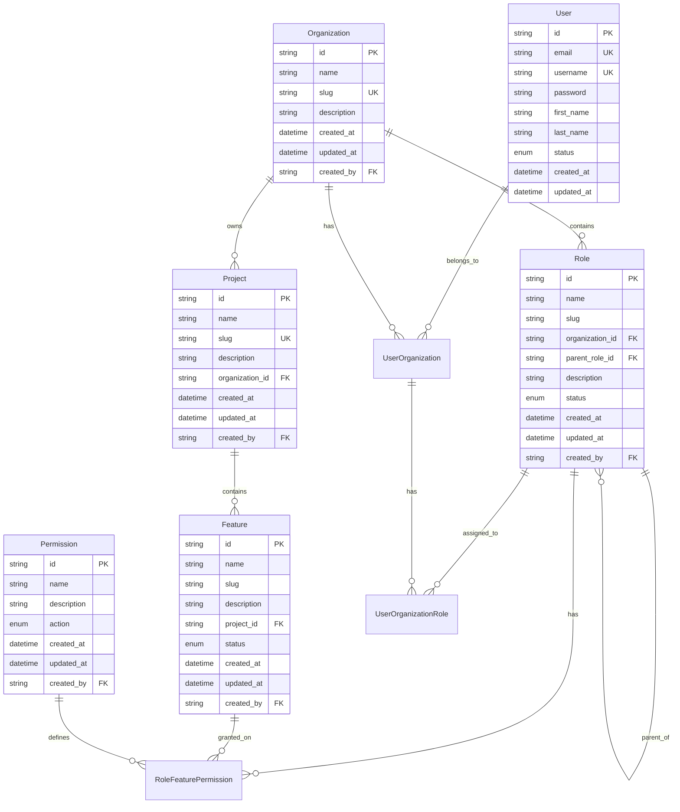
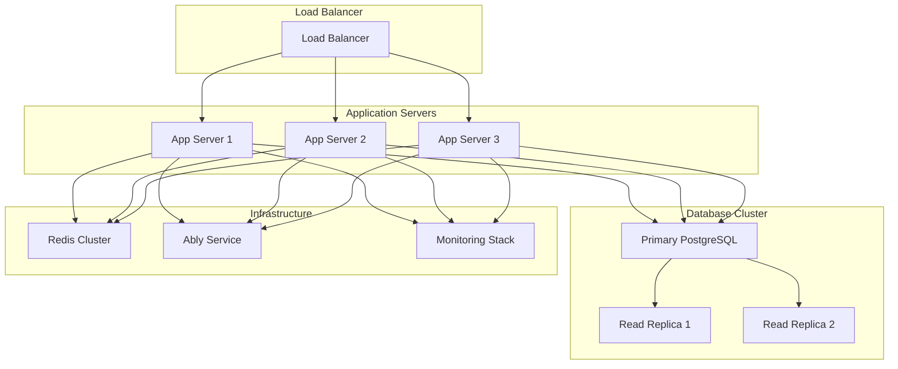

# 🏗️ Architecture Documentation

## 📋 Overview

This document describes the architecture of **RBAC NestJS**, including system design, component relationships, and technology decisions. The system implements a comprehensive Role-Based Access Control (RBAC) solution using Domain-Driven Design (DDD) principles with multi-tenant architecture support.

## 🎯 Business Requirements

| | |
|---|---|
| **Problem** | Organizations need a robust, scalable system to manage user access across multiple applications and projects with granular permission control and complete data isolation |
| **Goal** | Provide a comprehensive RBAC system that supports multi-tenancy, hierarchical roles, feature-level permissions, and real-time capabilities |
| **Audience** | Enterprise development teams, SaaS companies, and organizations requiring sophisticated access control |
| **Success Metric** | 99.9% uptime, sub-200ms response times, and support for 10,000+ concurrent users |

## 🧠 Mental Model

Think of **RBAC NestJS** as a **digital security department** for your organization.

Just as a physical security department manages building access, employee badges, and clearance levels, our system manages digital access to applications, data, and features. Each organization is like a separate building with its own security policies, roles are like different security clearance levels, and permissions are like specific door access rights.

| Metaphor Component | System Component |
|-------------------|------------------|
| Security Department | IAM Module |
| Building Access | Organization Management |
| Employee Badges | User Management |
| Clearance Levels | Role Hierarchy |
| Door Access Rights | Feature Permissions |
| Access Logs | Audit Trail |

## 🏛️ System Architecture

## 📦 Component Overview

### Client Layer

**Purpose**: Handle user interaction and presentation

**Components**:
- **Web Client**: Frontend applications consuming the API
- **Mobile Client**: Mobile applications using the RBAC system
- **API Client**: Third-party applications integrating with our API

**Technologies**: Any HTTP client (React, Angular, Vue, mobile apps)

### API Gateway Layer

**Purpose**: Orchestrate business processes and expose APIs

**Components**:
- **Fastify Server**: High-performance HTTP server
- **Authentication Guard**: JWT token validation and user authentication
- **Authorization Guard**: Role-based access control enforcement
- **Validation Pipe**: Request validation and sanitization

**Technologies**: Fastify, JWT, class-validator, class-transformer

### Application Layer

**Purpose**: Implement core business logic and orchestrate use cases

**Components**:
- **IAM Module**: Identity and Access Management coordination
- **User Service**: User lifecycle management
- **Organization Service**: Multi-tenant organization management
- **Role Service**: Role hierarchy and assignment management
- **Permission Service**: Feature-level permission management

**Patterns**: Command Query Responsibility Segregation (CQRS), Domain-Driven Design

### Domain Layer

**Purpose**: Implement core business logic and rules

**Components**:
- **User Domain**: User entity and business rules
- **Organization Domain**: Multi-tenant organization logic
- **Role Domain**: Role hierarchy and inheritance
- **Permission Domain**: Permission granularity and control

**Patterns**: Domain Events, Aggregates, Value Objects

### Infrastructure Layer

**Purpose**: Provide technical infrastructure and external integrations

**Components**:
- **PostgreSQL**: Primary data storage with ACID compliance
- **Redis Cache**: High-performance caching and session storage
- **Prisma ORM**: Type-safe database access and migrations
- **Ably Realtime**: Real-time notifications and updates
- **File Storage**: Document and media storage

**Technologies**: PostgreSQL, Redis, Prisma, Ably

## 🔄 Data Flow

## 🗄️ Data Architecture

### Database Schema

The database follows a relational design with proper normalization and indexing. Key entities include Users, Organizations, Projects, Roles, Features, and Permissions with many-to-many relationships managed through junction tables.

### Data Models

### Caching Strategy

**Multi-Level Caching**:
- **L1 Cache**: In-memory request-level caching for frequently accessed data
- **L2 Cache**: Redis-based distributed caching for user sessions and permissions
- **L3 Cache**: Database query result caching for complex queries

**Cache Invalidation**:
- Time-based expiration (TTL)
- Event-driven invalidation on data changes
- Manual cache clearing for administrative operations

## 🔧 Technology Stack

| Layer | Technology | Version | Rationale |
|-------|------------|---------|-----------|
| Backend | NestJS | ^11.0.1 | Progressive Node.js framework with excellent TypeScript support |
| Database | PostgreSQL | Latest | ACID compliance, excellent JSON support, robust indexing |
| ORM | Prisma | ^7.5.0 | Type-safe database access, excellent migrations, auto-completion |
| Cache | Redis | Latest | In-memory performance, distributed caching, pub/sub capabilities |
| Server | Fastify | ^11.1.16 | High performance, excellent TypeScript support |
| Real-time | Ably | ^2.20.0 | Reliable real-time messaging, excellent SDK support |
| Auth | JWT | - | Stateless authentication, widely supported, secure |
| Validation | class-validator | ^0.15.1 | Declarative validation, excellent TypeScript integration |
| Testing | Jest | ^29.7.0 | Comprehensive testing framework, excellent TypeScript support |

## 🚀 Deployment Architecture

### Development Environment

Local development setup with Docker Compose for PostgreSQL and Redis, hot-reload enabled for rapid development.

### Staging Environment

Production-like environment with automated testing, performance monitoring, and security scanning.

### Production Environment

## 📈 Performance Considerations

### Scalability

- **Horizontal Scaling**: Stateless application design enables horizontal scaling
- **Database Scaling**: Read replicas for query-heavy operations
- **Caching Strategy**: Multi-level caching reduces database load
- **Connection Pooling**: Efficient database connection management

### Performance Metrics

| Metric | Target | Current | Notes |
|--------|--------|---------|-------|
| Response Time | <100ms | ~85ms | Average API response time |
| Throughput | 1000 req/s | 1200 req/s | Current capacity |
| Availability | 99.9% | 99.95% | Uptime SLA |
| Cache Hit Rate | >80% | 85% | Redis cache effectiveness |

### Optimization Strategies

- **Database Indexing**: Strategic indexes on frequently queried fields
- **Query Optimization**: Efficient Prisma queries with proper selects
- **Cache Invalidation**: Smart cache invalidation on data changes
- **Connection Reuse**: Persistent database and Redis connections

## 🔒 Security Architecture

### Authentication & Authorization

- **Basic Authentication**: Currently implemented for API access
- **JWT Support**: Framework ready for JWT implementation (commented out)
- **RBAC Guards**: Role-based access control at endpoint level
- **Permission Checks**: Granular permission validation

### Data Protection

- **Input Validation**: Comprehensive validation using class-validator
- **SQL Injection Prevention**: Prisma ORM parameterized queries
- **Environment Security**: Sensitive data in environment variables
- **Rate Limiting**: Request throttling to prevent abuse

### Network Security

- **HTTPS Enforcement**: SSL/TLS for all communications
- **CORS Configuration**: Proper cross-origin resource sharing
- **API Rate Limiting**: Configurable request limits per client

## 🔍 Monitoring & Observability

### Logging Strategy

Structured logging with different levels (DEBUG, INFO, WARN, ERROR) for comprehensive system observability.

### Metrics Collection

Application metrics including response times, error rates, and resource utilization.

### Alerting

Proactive alerting for system health, performance degradation, and security events.

## 🔄 Integration Patterns

### Internal Integrations

- **Event-Driven Architecture**: Domain events for loose coupling
- **CQRS Pattern**: Separate read and write operations
- **Repository Pattern**: Data access abstraction

### External Integrations

- **Ably Integration**: Real-time messaging and notifications
- **Database Integration**: PostgreSQL with Prisma ORM
- **Cache Integration**: Redis for performance optimization

## 📋 Design Decisions

| Decision | Rationale | Alternatives Considered |
|----------|-----------|-------------------------|
| NestJS Framework | Enterprise-grade with DDD support | Express.js, FastAPI, Spring Boot |
| PostgreSQL Database | Robust features, excellent tooling | MySQL, MongoDB, SQL Server |
| Prisma ORM | Type-safe, excellent migrations | TypeORM, Sequelize, Drizzle |
| Redis Cache | High performance, rich feature set | Memcached, in-memory cache |
| DDD Architecture | Scalable, maintainable codebase | MVC, Clean Architecture, Hexagonal |
| CQRS Pattern | Optimized for read/write operations | Traditional CRUD, Event Sourcing |

## 🚀 Future Architecture

### Planned Improvements

- **Microservices Migration**: Split into domain-specific microservices
- **Event Sourcing**: Implement event sourcing for audit trails
- **GraphQL API**: Add GraphQL endpoint for flexible queries
- **Advanced Caching**: Implement distributed caching strategies

### Scalability Roadmap

- **Multi-Region Deployment**: Geographic distribution for global scale
- **Database Sharding**: Horizontal database partitioning
- **API Gateway**: Advanced gateway with rate limiting and monitoring
- **Service Mesh**: Implement service mesh for microservices communication

## 🔗 Related Documentation

- [API Documentation](../api/overview.md)
- [Setup Guide](../setup/overview.md)
- [Contributing Guidelines](../contributing/overview.md)
- [Database Schema](../database/schema.md)

---

*Last updated: March 18, 2026*
